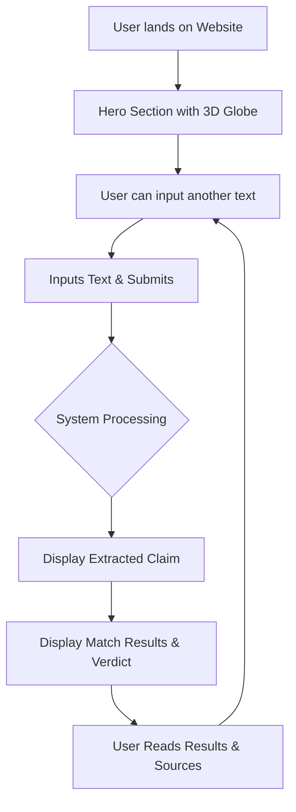

# 03. Information Architecture

## 🗺️ Sitemap

The platform is designed as a minimalist single-page application (SPA) focused tightly on the core value proposition: Fact Verification.

### 1. Main Application Page (`/`)
- **Header Structure**
  - **Logo:** Automated Fact Checker
  - **Sticky Navbar:** Smooth anchor links to page sections.
  - **Auth Links:** Sign Up / Login buttons

- **Hero Section (The 3D Experience)**
  - **Visual:** Interactive 3D floating globe (Three.js).
  - **Copy:** High-impact value proposition regarding multilingual fact-checking.
  - **Call to Action (CTA):** "Verify a Claim Now" (auto-scrolls to the verification tool).

- **Verification Tool Section**
  - **Input Area:** A clean, large text box accepting raw news or social media text.
  - **Submit Button:** "Check Facts" (triggers async processing with visual loading state).
  - **Result Area (Hidden until triggered):**
    - Extracted Claim Display
    - Verification Verdict Badge (`TRUE`, `FALSE`, `MISLEADING`, `UNKNOWN`)
    - Confidence Score / Accuracy Metric
    - Reference Sources (bulleted list of retrieved facts)

- **How it Works Section (Educational)**
  - Three succinct steps:
    1. Language Processing & Noise Optimization
    2. Vector Search against Trusted Facts
    3. AI Verification Engine comparison

- **Footer**
  - Legal (Terms & Conditions, Privacy Policy)
  - Developer / Team Information
  - Language toggles (if applicable for UI)

---

## 🔄 User Flow Diagram

