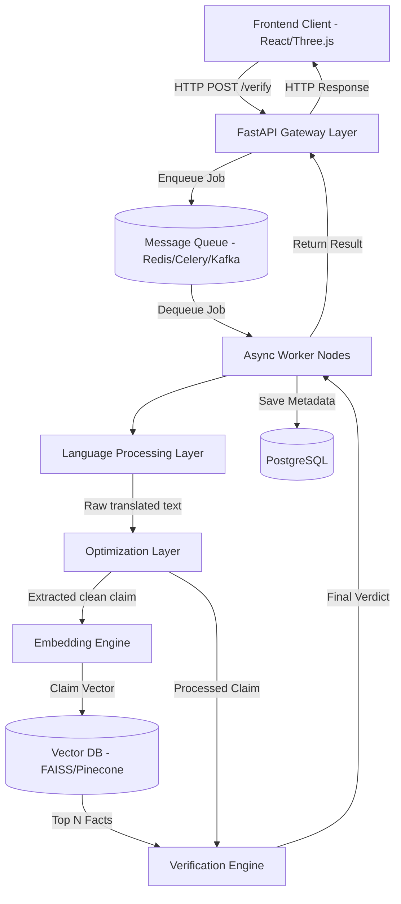

# 04. System Architecture

## 🏗️ High-Level System Architecture

The Automated Fact Checker operates on a distributed, microservice-inspired pipeline designed for high-speed, scalable NLP operations.

---

## 🔹 Core Components Detailed

### 1. Frontend (Client Layer)
- **Tech:** React.js, Tailwind CSS, Three.js, Framer Motion.
- **Responsibility:** Handles user input, provides premium 3D visualizations, and polls/receives responses from the backend API.

### 2. API & Ingestion Layer
- **Tech:** Python, FastAPI.
- **Responsibility:** Load balances incoming requests, manages API rate limiting, sanitizes inputs, and routes jobs to the async task queue. Can also expose direct endpoints for 3rd party integrations.

### 3. Language Processing Layer
- **Tech:** Indic NLP, Translation APIs.
- **Responsibility:** Detects the input language (e.g., Odia, Hindi). If non-English, it translates it to a uniform language (English) to maintain consistency in semantic search and optimization.

### 4. Optimization Layer (The Core Pre-processor)
- **Tech:** spaCy, lightweight HuggingFace Transformers.
- **Responsibility:** Strips emotional weight, clickbait framing, and filler words from the raw input. 
- **Example:** "Breaking! Drinking hot water cures all diseases 😱" → *“Claim: Drinking hot water cures diseases.”*

### 5. Fact Retrieval Engine (Embedding & Search)
- **Tech:** Sentence Transformers, FAISS / Pinecone.
- **Responsibility:** 
  - Converts the optimized claim into a dense vector embedding.
  - Queries the Vector Database to find the most semantically similar verified facts (stored beforehand from trusted sources like WHO or Govt).

### 6. Verification Engine
- **Tech:** Verification-specific LLM / Classifier (HuggingFace Transformers).
- **Responsibility:** Takes the extracted claim and aligns it against the retrieved facts to determine the final verdict: `TRUE`, `FALSE`, `MISLEADING`, `UNKNOWN`. Outputs an associated confidence score.

### 7. Storage Layer
- **Relational DB (PostgreSQL):** Stores user data, query metadata, cached results for repeated claims, and request analytics.
- **Vector DB (FAISS/Pinecone):** Stores embeddings of the verified truth dataset.

### 8. Async & Scalability Infrastructure
- **Tech:** Redis (broker/cache), Celery/Kafka (queue), Docker (containerization).
- **Responsibility:** Ensures heavy ML inference tasks run asynchronously without blocking the API gateway, allowing horizontal scaling of worker nodes processing the queue.
